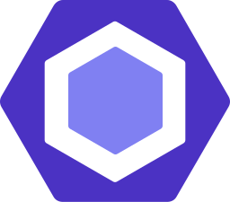
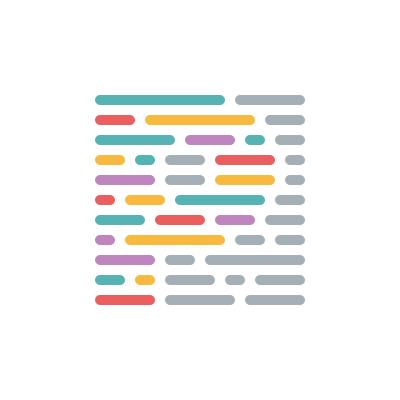

<div align="center">
  
</div>

<div align="center">
  
  
  
  
</div>

<br>

<p align="center">
  <a href="#tv-demonstração">Demonstração</a> | 
  <a href="#rocket-tecnologias-e-ferramentas">Tecnologias</a> | 
  <a href="#runner-como-executar-este-projeto">Como executar</a> | 
  <a href="#book-licença">Licença</a>
</p>

> Este projeto foi desenvolvido na Next Level week #2 criada pela [RocketSeat](https://rocketseat.com.br/)

###### Ler esta página em [Inglês](README.md)

# :tv: Demonstração

Visite o site [proffy-philipe.netlify.app](https://proffy-philipe.netlify.app/)

# :rocket: Tecnologias e Ferramentas

<div> 
  <a href="https://nodejs.org/"></a>
  <a href="https://yarnpkg.com/"></a>
  <a href="https://www.typescriptlang.org/"></a>
  <a href="https://expressjs.com/"></a>
  <a href="https://reactjs.org/"></a>
  <a href="https://reactnative.dev/"></a>
  <a href="https://create-react-app.dev/"></a>
  <a href="https://expo.io/"></a>
  <a href="https://eslint.org/"></a>
  <a href="https://prettier.io/"></a>
  <a href="https://code.visualstudio.com/"></a>
</div>

# :runner: Como executar este projeto

``` bash
# Clonar este repositório
$ git clone https://github.com/philipe-vieira/proffy.git

# Instalar as dependências
$ yarn

# Rodando a API
$ yarn api:run
# Ou, em modo de desenvolvimento
$ yarn api:run-dev

# Rodando aplicação Web
$ yarn web

# Rodando aplicação Mobile
$ yarn mobile
```

# :book: Licença

Este repositório é gerenciado por uma licença MIT. Para mais detalhes veja o arquivo de [licença](./LICENSE).

<br><br>

<div align="center">
  <p><strong>Conecte-se comigo</strong></p>
  <a href="https://www.linkedin.com/in/philipe-vieira-oliveira-b5a1b9148">
   
  </a>
  |
  <a href="https://twitter.com/_philipevieira">  </a> 
  |
  <a href="https://www.instagram.com/philiipe_vieira/"></a>
</div
