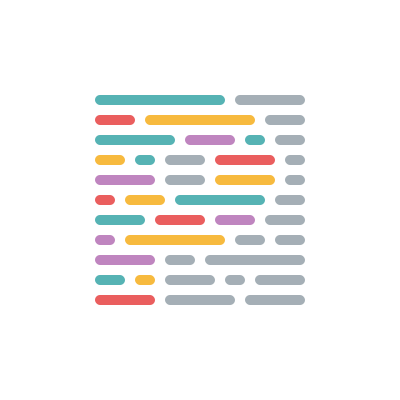

<div align="center">
  
</div>

<div align="center">
  
  
  
  
</div>

<br><br>

<p align="center">
  <a href="#tv-demo">Demo</a> | 
  <a href="#rocket-technologies-and-tools">Techs</a> | 
  <a href="#runner-how-to-run-this-project">How to run</a> | 
  <a href="#book-license">License</a>
</p>

<br>

###### Read this page in [Portuguese](README-pt-br.md)

<br><br>

> This project was be developed in Next Level week #2 made by [RocketSeat](https://rocketseat.com.br/)

<br>

# :tv: Demo

Visit the site [proffy-philipe.netlify.app](https://proffy-philipe.netlify.app/)

# :rocket: Technologies and Tools

<div> 
  <a href="https://nodejs.org/"></a>
  <a href="https://yarnpkg.com/"></a>
  <a href="https://www.typescriptlang.org/"></a>
  <a href="https://expressjs.com/"></a>
  <a href="https://reactjs.org/"></a>
  <a href="https://reactnative.dev/"></a>
  <a href="https://create-react-app.dev/"></a>
  <a href="https://expo.io/"></a>
  <a href="https://eslint.org/"></a>
  <a href="https://prettier.io/"></a>
  <a href="https://code.visualstudio.com/"></a>
</div>

# :runner: How to run this project

```bash
# Clone this repository
$ git clone https://github.com/philipe-vieira/proffy.git

# Install dependencies
$ yarn

# Running API
$ yarn api:run
# Or, in development mode
$ yarn api:run-dev

# Running Web App
$ yarn web

# Running Mobile App
$ yarn mobile
```

# :book: License

This repository is managed by a mit license. For more details see [license](./LICENSE) file.

<br><br>

<div align="center">
  <p><strong>Connect with me</strong></p>
  <a href="https://www.linkedin.com/in/philipe-vieira-oliveira-b5a1b9148">
   
  </a>
  |
  <a href="https://twitter.com/_philipevieira">  </a> 
  |
  <a href="https://www.instagram.com/philiipe_vieira/"></a>
</div
